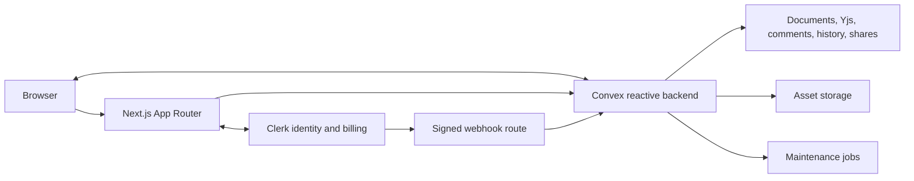
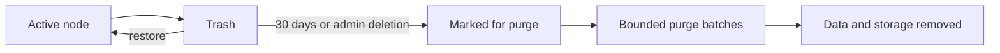

# Stash

## Collaborative document workspace for Markdown, HTML, and rich text

[](https://github.com/DataRohit/Stash/actions/workflows/quality.yml)
[](https://github.com/DataRohit/Stash)
[](./LICENSE)
[](./package.json)
[](https://nextjs.org)
[](https://react.dev)
[](https://www.typescriptlang.org)
[](https://convex.dev)
[](https://clerk.com)
[](https://pnpm.io)

**Stash organizes collaborative documents, assets, discussion, history, search, and controlled sharing inside organization-scoped projects.**

[Features](#key-features) · [Architecture](#architecture) · [Technology](#technology-stack) · [Setup](#local-development) · [Quality](#quality-verification) · [Production](#production-deployment)

---

## Overview

Stash is a multi-tenant document workspace built for teams that maintain Markdown, HTML, and rich-text content together. Every format participates in real-time collaboration, comments, version history, search, sharing, and export. Convex owns reactive data and authorization boundaries; Clerk owns sessions, organizations, roles, invitations, and billing-plan data.

The repository includes the complete application and local backend workflow. Production account provisioning, webhook configuration, deployment, and monitoring remain operator-controlled requirements.

## Key features

### Documents and files

- Nested project folders with Markdown, HTML, rich-text, image, and SVG nodes.
- Multi-file Markdown, HTML, and text import with 512 KB file limits.
- Drag-and-drop movement with cycle prevention and an accessible move dialog.
- File duplication with collision-safe names and independent collaboration state.
- Thirty-day trash, restoration, administrator-only permanent deletion, and bounded purge jobs.
- Project and plan storage accounting enforced at the backend boundary.

### Editing and collaboration

- CodeMirror 6 editors for Markdown and HTML.
- Tiptap editor for collaborative rich text.
- Yjs incremental synchronization over Convex with snapshots and compaction.
- Presence and remote cursors with session ownership protection.
- Cross-file link completion, synchronized outlines, and image paste or drop.
- Sandboxed Markdown, Mermaid, and full HTML preview.

### Review and communication

- Yjs-relative comment anchors for code and rich-text editors.
- Replies, resolution, reopening, mentions, and notification preferences.
- Version checkpoints, text comparison, restoration, and live collaborator updates.
- Project activity feed with actor, target, event type, and time.

### Search and navigation

- Full-text search across every accessible project.
- Token-aware multi-term results without contiguous-substring loss.
- Dashboard quick-open palette with project, path, file, and content results.
- Per-user recent-document tracking with access revalidation.

### Sharing and export

- Private, organization-only, and public read-only document modes.
- Optional expiry and share-token rotation.
- Organization policy that degrades public links to organization access.
- Public-edge throttling isolated by token and IP.
- Standalone HTML, print/PDF, Markdown, and project ZIP export.

### Organizations and authorization

- Mandatory Clerk organizations and organization-scoped routing.
- Administrator, editor, and viewer behavior.
- Server-side organization, role, membership, project-grant, and mutation checks.
- Project, member, collaborator, and storage plan limits.
- Clerk webhook synchronization with a local reconciliation fallback.

## Architecture



Authorization is enforced inside Convex public functions. UI restrictions are presentation controls and are not treated as security boundaries.

### Data lifecycle



Scheduled functions sweep stale presence, prune history, notifications, activity and share windows, purge expired trash, resume interrupted purges, and reap failed project clones.

## Technology stack

| Area | Technology | Purpose |
| --- | --- | --- |
| Web | Next.js 16, React 19 | App Router, server rendering, server actions |
| Language | TypeScript 5 | Strict application and backend types |
| Backend | Convex | Reactive database, functions, storage, scheduled jobs |
| Identity | Clerk | Authentication, organizations, roles, plans, invitations |
| Collaboration | Yjs | Shared document state and relative positions |
| Code editing | CodeMirror 6 | Markdown and HTML editing |
| Rich text | Tiptap 3 | ProseMirror-based collaborative editing |
| Rendering | marked, Mermaid, Resvg | Markdown, diagrams, and SVG processing |
| Styling | Tailwind CSS 4 | Theme tokens and application styling |
| Testing | Vitest | Automated regression tests |
| Quality | Biome, ESLint, TypeScript, Knip | Formatting and static verification |
| Package management | pnpm 11 | Reproducible dependency installation |

## Project structure

```text
stash/
├── app/                 Next.js routes, server actions, editor, share view
├── components/          UI primitives, providers, dashboard and landing UI
├── convex/              Schema, public functions, internal jobs, generated API
├── lib/                 Billing, identity, server and domain helpers
├── tools/               Repository verification and local dashboard helpers
├── .github/             CI, dependency updates, issue and PR templates
├── .husky/              Staged-file and commit-message hooks
├── .env.example         Required local and production configuration keys
├── convex.json          Convex project configuration
├── package.json         Scripts and dependency manifest
└── pnpm-lock.yaml       Locked dependency graph
```

## Prerequisites

- Node.js 22 or later; `.nvmrc` pins the repository runtime.
- pnpm 11 through Corepack.
- A Clerk development instance for authenticated workflows.
- No Convex account is required for local development.

```bash
corepack enable
pnpm install --frozen-lockfile
```

## Configuration

Copy the environment template:

```bash
cp .env.example .env.local
```

| Variable | Required for | Handling |
| --- | --- | --- |
| `NEXT_PUBLIC_SITE_URL` | Canonical application URL | Public |
| `CONVEX_DEPLOYMENT` | Convex target | Server tooling |
| `NEXT_PUBLIC_CONVEX_URL` | Browser Convex client | Public |
| `NEXT_PUBLIC_CONVEX_SITE_URL` | Convex HTTP endpoint | Public |
| `NEXT_PUBLIC_CLERK_PUBLISHABLE_KEY` | Clerk browser SDK | Public |
| `CLERK_SECRET_KEY` | Clerk server API | Secret |
| `CLERK_WEBHOOK_SIGNING_SECRET` | Webhook verification | Secret |
| `CONVEX_PURGE_SECRET` | Trusted server-to-Convex operations | Secret, 32+ random characters |
| `SHARE_IP_SALT` | Share throttle privacy | Secret, independent random value |
| `CLERK_JWT_ISSUER_DOMAIN` | Convex JWT verification | Server configuration |

Never commit `.env.local` or production credentials.

## Local development

```bash
pnpm dev:local
```

The command initializes local Convex and runs the database, web application, and local dashboard helper together.

| Address | Service |
| --- | --- |
| `http://localhost:3000` | Stash web application |
| `http://127.0.0.1:6790` | Local Convex dashboard |
| `http://127.0.0.1:3210` | Local Convex client endpoint |
| `http://127.0.0.1:3211` | Local Convex HTTP endpoint |

Independent processes:

```bash
pnpm db:setup
pnpm dev:db
pnpm dev:web
```

## Quality verification

Run the complete release gate:

```bash
pnpm check
```

The gate runs fail-fast in this order:

```text
package order → formatting → ESLint → TypeScript → unused code
→ spelling → secret scan → Markdown → source policy → production build
```

| Command | Function |
| --- | --- |
| `pnpm check` | Execute the complete release gate |
| `pnpm fix` | Apply supported formatting and lint fixes |
| `pnpm typecheck` | Run strict TypeScript checking |
| `pnpm lint` | Run Next.js ESLint rules with zero warnings |
| `pnpm knip` | Detect unused files, exports, and dependencies |
| `pnpm secrets` | Scan tracked content for credentials |
| `pnpm build` | Create the optimized production build |

CI installs from the frozen lockfile and executes `pnpm check` for every push to `main` or `master` and every pull request.

## Security controls

- Convex functions validate authenticated identity, active organization, organization role, project grant, and write level.
- Viewers cannot modify documents, comments, checkpoints, files, or shares.
- Presence removal requires ownership of the target session.
- Share tokens contain 256 random bits and support expiry and rotation.
- Public share throttling uses a salted token-and-IP digest; raw IP addresses are not stored.
- Server service secrets use constant-time comparison.
- HTML preview runs in a sandboxed iframe.
- Upload type, file size, project size, tree depth, and node-count limits are enforced server-side.
- Secretlint runs locally and in CI.

## Production deployment

Production deployment is an operator-controlled process. Repository checks do not prove that account-side controls are active.

Minimum deployment commands:

```bash
pnpm install --frozen-lockfile
pnpm check
npx convex deploy
pnpm build
```

Production approval additionally requires:

- A production Clerk instance and `convex` JWT template containing `org_id` and `org_role`.
- Production billing plans and limits.
- A signed Clerk webhook configured for `/api/webhooks/clerk`.
- Strong independent purge and share-rate secrets.
- External health monitoring for `/api/health`.
- Convex scheduled-function failure and purge-backlog visibility.
- Successful execution of every runbook acceptance check.

Repository code alone does not prove these account-side controls are active.

## Performance verification

Performance work is accepted only when before-and-after measurements use the same machine, browser, network profile, dataset, and production build. Record the source commit, browser trace, route bundle output, editor interaction readiness, preview latency, Mermaid cancellation latency, and collaboration replay time.

## Repository conventions

- Use pnpm only.
- Use Conventional Commits.
- Do not add source comments to authored `.ts`, `.tsx`, or `.css` files.
- Use Biome instead of Prettier.
- Register Tailwind design values as theme tokens; do not introduce arbitrary values.
- Run `pnpm fix` and `pnpm check` before committing.
- Update the README with behavior changes.

## Contributing

1. Fork the repository.
2. Create a focused branch.
3. Implement one coherent change.
4. Run `pnpm fix` and `pnpm check`.
5. Commit with a Conventional Commit message.
6. Open a pull request with verification evidence.

## License

Stash is distributed under the [MIT License](./LICENSE).

## Author

### Rohit Vilas Ingole

- [GitHub](https://github.com/DataRohit)
- [LinkedIn](https://www.linkedin.com/in/rohit-vilas-ingole)
- [Email](mailto:rohit.vilas.ingole@gmail.com)

## Resources

- [Next.js documentation](https://nextjs.org/docs)
- [Convex documentation](https://docs.convex.dev)
- [Clerk documentation](https://clerk.com/docs)
- [Yjs documentation](https://docs.yjs.dev)
- [CodeMirror documentation](https://codemirror.net/docs/)
- [Tiptap documentation](https://tiptap.dev/docs)

---

**Built by [Rohit Vilas Ingole](https://github.com/DataRohit).**
