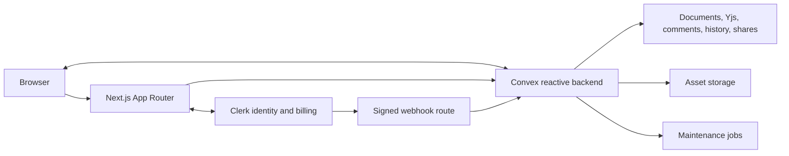
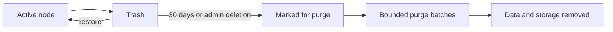

# Stash

## Collaborative document workspace for Markdown and HTML

[](https://github.com/DataRohit/Stash/actions/workflows/quality.yml)
[](https://github.com/DataRohit/Stash)
[](./LICENSE)
[](./package.json)
[](https://nextjs.org)
[](https://react.dev)
[](https://www.typescriptlang.org)
[](https://convex.dev)
[](https://clerk.com)
[](https://pnpm.io)

**Stash organizes collaborative documents, assets, discussion, history, search, and controlled sharing inside organization-scoped projects.**

[Features](#key-features) · [Architecture](#architecture) · [Technology](#technology-stack) · [Setup](#local-development) · [Quality](#quality-verification) · [Production](#production-deployment)

---

## Overview

Stash is a multi-tenant, developer-first document workspace built for teams that
maintain Markdown and HTML together. Both formats participate in real-time
collaboration, comments, version history, search, sharing, and export. Convex owns
reactive data and authorization boundaries; Clerk owns sessions, organizations,
roles, invitations, and billing-plan data.

The repository includes the complete application and local backend workflow. Production account provisioning, webhook configuration, deployment, and monitoring remain operator-controlled requirements.

## Security and data-integrity hardening

Stash includes safeguards for authenticated write abuse, share-boundary validation,
storage accuracy, and bounded data cleanup. Collaboration updates and presence
heartbeats are throttled per user and document; malformed share inputs are
rejected before lookup; shared routes use a dedicated content security policy;
asset uploads accept only approved raster formats; and notification visibility
reuses authorization results only for the duration of one query.

Storage counters, retained history, deleted content, unattached uploads, and
recent-document lists have bounded reconciliation or cleanup paths. These
safeguards complement the existing organization, role, project-grant, mutation,
and quota checks enforced by the backend.

Repository verification does not replace acceptance in a configured release
candidate. Public launch remains blocked until that environment successfully
completes authenticated rate soaks, a trusted-proxy spoofing matrix, real shared
document rendering, byte-counter reconciliation, orphan-deletion safety checks,
near-quota history checks, and recent-document pruning checks.

## Responsive and accessible interface

The editor keeps its primary actions reachable on narrow screens and switches
to a single editor or preview pane below the tablet breakpoint without losing
the saved desktop split-view choice. Comments, outline, file navigation, and
version history use mobile sheets with bounded internal scrolling; version
history places the checkpoint list above its unified comparison on small
screens. Dashboard cards, organization controls, invitations, and public landing
sections reflow for touch use without body-level horizontal scrolling at the
supported mobile widths.

Dialogs and editor popovers share keyboard focus containment, Escape dismissal,
opener-focus restoration, and modal scroll locking where appropriate. The
read-only preview is visibly identified and skipped by sequential keyboard
navigation, status and presence colors meet normal-text contrast targets, error
and toast messages are announced, and page, view-transition, reveal, marquee,
and presence motion honor the operating system's reduced-motion preference.

Repository-level checks cover formatting, linting, types, dependency use,
spelling, secrets, source policy, and production compilation. Final release
acceptance must also exercise the authenticated editor, sheets, focus order,
screen-reader announcements, and reduced-motion behavior in the configured
release candidate on representative mobile and desktop browsers.

## Resilience and observability

Operational failures use stable structured server events while read-only pages
retain explicit fallback states. Clerk webhook verification failures are rejected,
and verified events that fail during processing return a retryable server response
instead of acknowledging incomplete synchronization. Editor and public-share
routes have local recovery screens so an isolated rendering failure does not take
down the surrounding application shell.

The editor derives write and administrator controls from the live project grant.
If edit access is revoked during a session, editing becomes read-only within the
next reactive update and the editor explains the change. Transient collaboration
failures retain local updates and display a persistent reconnecting count until
the pending edits synchronize. The lightweight `/api/health` response is suitable
for load balancers; `/api/health?deep=1` also verifies Convex reachability and
returns a service-unavailable status when that dependency cannot be reached.

## Performance and scale safeguards

Large file trees use windowed rendering with overscan, keeping mounted rows
bounded while retaining selection, keyboard navigation, expansion, rename,
drag-and-drop, and move operations. Project tree queries no longer sign every
stored asset URL: URLs are requested only for a selected asset, assets referenced
by the visible preview, or assets required by an export.

Organization-wide search uses bounded organization-scoped name and content
indexes, then revalidates project access and inactive ancestors before returning
results. Comment-range memoization depends on stable collaborative document
references, optional mention and share subscriptions activate only while their
panels are open, and history-comparison and Mermaid code remain behind route or
dynamic import boundaries.

## Consistent workspace experience

Known backend failures use one user-facing message catalog across document,
sharing, template, access, and collaboration actions. Data-driven views distinguish
loading skeletons, empty results, and recoverable route errors so an unavailable
query is not presented as an empty workspace.

Dates for recent activity, notifications, comments, history, sharing events, and
save status use the same relative-time language, with exact timestamps available
on hover. Storage values use one byte formatter throughout the dashboard and
editor. In the editor, press `?` outside a text field to open the shortcut
reference; `Ctrl`/`Cmd` + `K` opens workspace search and `Ctrl`/`Cmd` + `S`
confirms that changes synchronize automatically.

## Key features

### Documents and files

- Nested project folders with Markdown, HTML, and PNG, JPEG, GIF, WebP, or AVIF
  image nodes.
- Document names accept only `.md` and `.html`. Entering either extension in the
  creation dialog selects the matching format automatically; names without an
  extension use the selected format and receive its canonical extension.
- Multi-file `.md` and `.html` import with 512 KB file limits.
- Drag-and-drop movement with cycle prevention and an accessible move dialog.
- File duplication with collision-safe names and independent collaboration state.
- Thirty-day trash, restoration, administrator-only permanent deletion, and bounded purge jobs.
- Project and plan storage accounting enforced at the backend boundary.

### Editing and collaboration

- CodeMirror 6 editors for Markdown and HTML.
- Yjs incremental synchronization over Convex with snapshots and compaction.
- Presence and remote cursors with session ownership protection.
- Cross-file link completion, synchronized outlines, and image paste or drop.
- Sandboxed Markdown, Mermaid, and full HTML preview.

### Review and communication

- Yjs-relative comment anchors for Markdown and HTML editors.
- Replies, resolution, reopening, mentions, and notification preferences.
- Version checkpoints, text comparison, restoration, and live collaborator updates.
- Project activity feed with actor, target, event type, and time.

### Search and navigation

- Full-text search across every accessible project.
- Token-aware multi-term results without contiguous-substring loss.
- Dashboard quick-open palette with project, path, file, and content results.
- Per-user, organization-scoped recent-document tracking with access
  revalidation and a bounded history.

### Sharing and export

- Private, organization-only, and public read-only document modes.
- Optional expiry and share-token rotation.
- Organization policy that degrades public links to organization access.
- Public-edge throttling isolated by token and IP.
- Standalone HTML, print/PDF, Markdown, and project ZIP export.

### Organizations and authorization

- Mandatory Clerk organizations and organization-scoped routing.
- Administrator, editor, and viewer behavior.
- Server-side organization, role, membership, project-grant, and mutation checks.
- Project, member, collaborator, and storage plan limits.
- Clerk webhook synchronization with a local reconciliation fallback.

## Architecture



Authorization is enforced inside Convex public functions. UI restrictions are presentation controls and are not treated as security boundaries.

### Data lifecycle and scheduled maintenance



Trash entries show a countdown to automatic deletion after 30 days and highlight
the final three days. Expired trash and permanent deletions drain through bounded,
resumable purge jobs.

History uses a separate per-document budget, a 50-checkpoint ceiling, and
plan-derived retention that defaults to 30 days. It is pruned independently and
does not consume the live project storage quota. Recent documents are capped at
100 entries per user and organization when opened, with a daily fallback prune.

Scheduled maintenance also sweeps stale presence; prunes notifications, activity,
share windows, and authenticated-write windows; reconciles project byte counters
daily; removes unattached storage objects older than 24 hours in a weekly sweep;
and reaps failed project clones.

## Technology stack

| Area | Technology | Purpose |
| --- | --- | --- |
| Web | Next.js 16, React 19 | App Router, server rendering, server actions |
| Language | TypeScript 5 | Strict application and backend types |
| Backend | Convex | Reactive database, functions, storage, scheduled jobs |
| Identity | Clerk | Authentication, organizations, roles, plans, invitations |
| Collaboration | Yjs | Shared document state and relative positions |
| Code editing | CodeMirror 6 | Markdown and HTML editing |
| Rendering | marked, Mermaid, Resvg | Markdown, diagrams, and SVG processing |
| Styling | Tailwind CSS 4 | Theme tokens and application styling |
| Quality | Biome, ESLint, TypeScript, Knip | Formatting and static verification |
| Package management | pnpm 11 | Reproducible dependency installation |

## Project structure

```text
stash/
├── app/                 Next.js routes, server actions, editor, share view
├── components/          UI primitives, providers, dashboard and landing UI
├── convex/              Schema, public functions, internal jobs, generated API
├── lib/                 Billing, identity, server and domain helpers
├── tools/               Repository verification and local dashboard helpers
├── .github/             CI, dependency updates, issue and PR templates
├── .husky/              Staged-file and commit-message hooks
├── .env.example         Required local and production configuration keys
├── convex.json          Convex project configuration
├── package.json         Scripts and dependency manifest
└── pnpm-lock.yaml       Locked dependency graph
```

## Prerequisites

- Node.js 22 or later; `.nvmrc` pins the repository runtime.
- pnpm 11 through Corepack.
- A Clerk development instance for authenticated workflows.
- No Convex account is required for local development.

```bash
corepack enable
pnpm install --frozen-lockfile
```

## Configuration

Copy the environment template:

```bash
cp .env.example .env.local
```

| Variable | Required? | Purpose |
| --- | --- | --- |
| `NEXT_PUBLIC_SITE_URL` | Yes | Canonical public application URL |
| `CONVEX_DEPLOYMENT` | Yes | Convex deployment selected by local tooling |
| `NEXT_PUBLIC_CONVEX_URL` | Yes | Browser and server Convex client endpoint |
| `NEXT_PUBLIC_CONVEX_SITE_URL` | Yes | Convex HTTP actions endpoint |
| `NEXT_PUBLIC_CLERK_PUBLISHABLE_KEY` | Yes | Public Clerk browser configuration |
| `CLERK_SECRET_KEY` | Yes | Clerk server API and billing-plan reads |
| `CLERK_WEBHOOK_SIGNING_SECRET` | For webhooks | Verifies Clerk membership and organization events |
| `CONVEX_PURGE_SECRET` | Yes | Authenticates trusted Next.js-to-Convex operations; use 32+ random characters |
| `SHARE_IP_SALT` | Yes | Hashes client addresses used by public-share throttling; use an independent random value |
| `SHARE_TRUST_FORWARDED` | No | Defaults to `0`; set to `1` only behind a trusted proxy or CDN that overwrites forwarding headers |
| `CLERK_JWT_ISSUER_DOMAIN` | Yes | Verifies Clerk session JWTs inside Convex |
| `NEXT_PUBLIC_CLERK_SIGN_IN_URL` | No | Overrides the sign-in route; template default is `/sign-in` |
| `NEXT_PUBLIC_CLERK_SIGN_UP_URL` | No | Overrides the sign-up route; template default is `/sign-up` |
| `NEXT_PUBLIC_CLERK_SIGN_IN_FORCE_REDIRECT_URL` | No | Post-sign-in destination; template default is `/dashboard` |
| `NEXT_PUBLIC_CLERK_SIGN_UP_FORCE_REDIRECT_URL` | No | Post-sign-up destination; template default is `/dashboard` |
| `RESEND_API_KEY` | No | Reserved for optional notification-email delivery; unused by the current runtime |
| `RESEND_FROM_EMAIL` | No | Reserved verified sender for optional Resend delivery |

Never commit `.env.local` or production credentials.

## Local development

```bash
pnpm dev:local
```

The command initializes local Convex and runs the database, web application, and local dashboard helper together.

For a first boot:

1. Create a Clerk development application, enable Organizations, and copy its
   publishable and secret keys into `.env.local`.
2. Add a Clerk JWT template named `convex`, then set
   `CLERK_JWT_ISSUER_DOMAIN` to the development instance issuer.
3. Replace `CONVEX_PURGE_SECRET` and `SHARE_IP_SALT` with independent random
   development values. Leave the optional Resend values empty.
4. Run `pnpm dev:local`, open the web address below, sign in, and create or join
   an organization.

`CLERK_WEBHOOK_SIGNING_SECRET` is needed only when exercising Clerk webhook
synchronization locally. Dashboard reconciliation keeps organization membership
usable during local development without a public webhook tunnel.

| Address | Service |
| --- | --- |
| `http://localhost:3000` | Stash web application |
| `http://127.0.0.1:6790` | Local Convex dashboard |
| `http://127.0.0.1:3210` | Local Convex client endpoint |
| `http://127.0.0.1:3211` | Local Convex HTTP endpoint |

Independent processes:

```bash
pnpm db:setup
pnpm dev:db
pnpm dev:web
```

## Quality verification

Run the complete release gate:

```bash
pnpm check
```

The gate runs fail-fast in this order:

```text
package order → formatting → ESLint → TypeScript → unused code
→ spelling → secret scan → Markdown → source policy → production build
```

| Command | Function |
| --- | --- |
| `pnpm check` | Execute the complete release gate |
| `pnpm fix` | Apply supported formatting and lint fixes |
| `pnpm typecheck` | Run strict TypeScript checking |
| `pnpm lint` | Run Next.js ESLint rules with zero warnings |
| `pnpm knip` | Detect unused files, exports, and dependencies |
| `pnpm secrets` | Scan tracked content for credentials |
| `pnpm build` | Create the optimized production build |

CI installs from the frozen lockfile and executes `pnpm check` for every push to `main` or `master` and every pull request.

## Security controls

- Convex functions validate authenticated identity, active organization, organization role, project grant, and write level.
- Viewers cannot modify documents, comments, checkpoints, files, or shares.
- Collaboration updates and presence heartbeats use per-user, per-document write throttles after authentication and access checks.
- Presence removal requires ownership of the target session.
- Share tokens contain 256 random bits and support expiry and rotation; malformed tokens are rejected before lookup.
- Public share throttling uses a salted token-and-IP digest; raw IP addresses are not stored.
- Forwarded share-client addresses are ignored by default; trusted forwarding can be enabled only through the documented proxy setting.
- Shared routes use a content security policy that constrains scripts, styles, images, fonts, connections, and frames while disabling base and form targets.
- Server service secrets use constant-time comparison.
- HTML preview runs in a sandboxed iframe.
- Asset uploads use a server-enforced PNG, JPEG, GIF, WebP, and AVIF MIME allowlist; file size, project size, tree depth, and node-count limits are also enforced server-side.
- Notification queries revalidate visibility and reuse per-project access decisions only within the current query.
- Secretlint runs locally and in CI.

The controls above describe the current repository and do not constitute
public-launch approval. The configured release-candidate checks listed under
security and data-integrity hardening must pass before public deployment.

## Production deployment

Production deployment is an operator-controlled process. Repository checks do not prove that account-side controls are active.

Minimum deployment commands:

```bash
pnpm install --frozen-lockfile
pnpm check
npx convex deploy
pnpm build
```

Production approval additionally requires:

- A production Clerk instance and `convex` JWT template containing `org_id` and `org_role`.
- Production billing plans and limits.
- A signed Clerk webhook configured for `/api/webhooks/clerk`.
- Strong independent purge and share-rate secrets.
- Lightweight availability monitoring for `/api/health` and dependency-aware
  monitoring for `/api/health?deep=1`.
- Convex scheduled-function failure and purge-backlog visibility.
- A coordinated Convex and frontend rollout before public launch; content in any
  active pre-release editor tabs must be synced or copied before those tabs are
  refreshed or closed.
- Successful authenticated rate soaks, trusted-proxy spoofing checks, real share
  rendering, counter reconciliation, orphan-deletion safety checks, near-quota
  history checks, and recent-document pruning in the release candidate.

Repository code alone does not prove these account-side controls are active.

## Performance verification

Performance work is accepted only when before-and-after measurements use the same machine, browser, network profile, dataset, and production build. Record the source commit, browser trace, route bundle output, mounted tree-row count, editor interaction readiness, preview latency, asset URL requests, search function reads, Mermaid cancellation latency, and collaboration replay time.

## Repository conventions

- Use pnpm only.
- Use Conventional Commits.
- Do not add source comments to authored `.ts`, `.tsx`, or `.css` files.
- Use Biome instead of Prettier.
- Register Tailwind design values as theme tokens; do not introduce arbitrary values.
- Run `pnpm fix` and `pnpm check` before committing.
- Update the README with behavior changes.

## Contributing

1. Fork the repository.
2. Create a focused branch.
3. Implement one coherent change.
4. Run `pnpm fix` and `pnpm check`.
5. Commit with a Conventional Commit message.
6. Open a pull request with verification evidence.

## License

Stash is distributed under the [MIT License](./LICENSE).

## Author

### Rohit Vilas Ingole

- [GitHub](https://github.com/DataRohit)
- [LinkedIn](https://www.linkedin.com/in/rohit-vilas-ingole)
- [Email](mailto:rohit.vilas.ingole@gmail.com)

## Resources

- [Next.js documentation](https://nextjs.org/docs)
- [Convex documentation](https://docs.convex.dev)
- [Clerk documentation](https://clerk.com/docs)
- [Yjs documentation](https://docs.yjs.dev)
- [CodeMirror documentation](https://codemirror.net/docs/)

---

**Built by [Rohit Vilas Ingole](https://github.com/DataRohit).**
